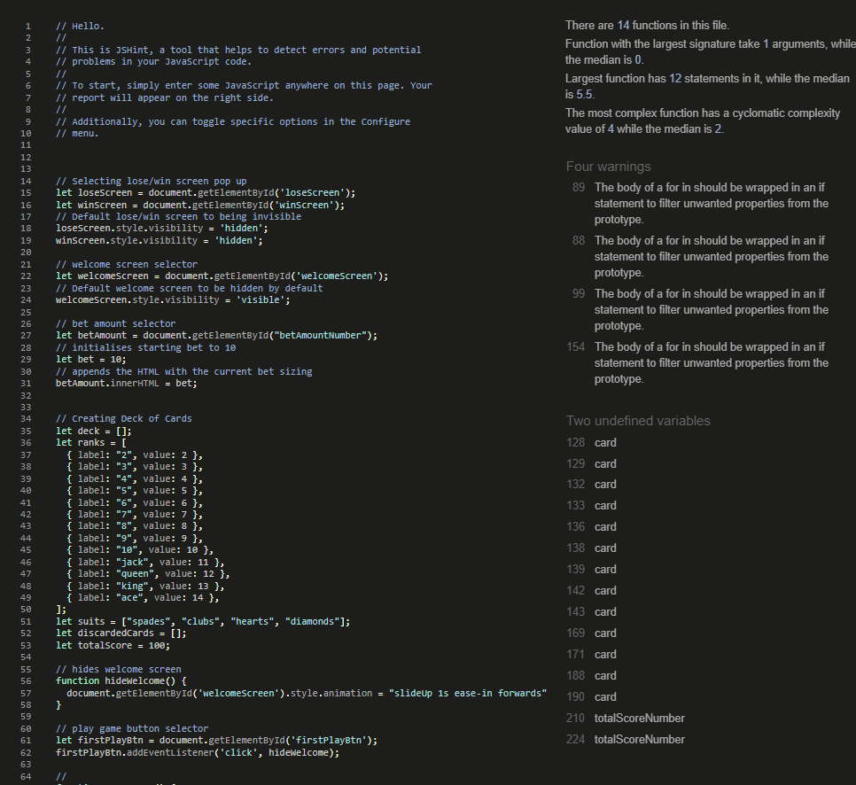

# Higher or Lower Game

## Milestone Project 2 - Interactive Front-End Site


Higher or Lower is a card game where you guess whether the next card is higher or loer than the one you are shown. The player can bet points to try and get the highest score possible.

## Live Project

[Live Site Link](https://lewbeavendev.github.io/Higher_or_Lower/)

## Repository

[View The Repository Here](https://github.com/LewBeavenDev/Higher_or_Lower?tab=readme-ov-file)

## Site Owner Goals

- To provide the user with a fun mini game.
- To allow the user to keep track of a points total.
- To allow the user to bet different amounts of points to potentially win more points.
- To package the game within an aesthetically pleasing, modern looking page that is easy to use and fun to play.
- To make the game fully in vanilla JavaScript to grow my foundation of knowledge.

# Design Choices

## Color Scheme


- The color palette of the page is inspired by casino/online poker tables. Dark background with a bright green felt color table keeping the users eyes on what is important. Bright differently colored buttons to highlight to the user the difference and function.

- overall the color scheme is simple but pops and draws the users eyes to what is important.

## Typography

- I have used the Open Sans font for the whole page as it is easily readable and keeps the pages looking clean and simple.

## Aesthetics

- The overall aesthetics reflect the table of a card game. The smooth edges and pastel buttons are easy on the eyes and clearly redable.
- The eyes naturally focus on the card in the center as it sits in its own seperate compartment.

# Wireframes


- My wireframe was made in Figma

# Features

## Landing/Welcome Page


- The landing page instantly welcomes you to the page and explains the rules of the game and how it works.
- Due to there only being one page on the website the site doesnt have a traditional nav bar, instead a header that functions as a button which resets the page for the user.
- The Play button has a tactile hover and active effect alongside a birght but soft color to clearly navigate the user to the game.
- The button has a tactile click sound upon press to give a pleasing sensory feel to it.

## Game Page Features


- The play area has the main card area showing the user the card drawn. This is generated through various arrays and properly shuffled and the result is assigned the corresponding card .svg to show the user the card drawn.
- Underneath are the user interface buttons. Both sides are differently colored so the user subconsciously understands the two pairs of buttons are for different things.
- The increase and decrease bet buttons are placed above and below the bet size so the user intuitively knows what to expect upon pressing the buttons.
- The users total score is placed in the middle as that is the key score the user wants to keep track of.
- The higher/lower and increase/decrease buttons are placed with the higher on top and lower below to further make the interface feel intuitive.

## Lose Screen Features


- The game loss screen is clearly colored red to show to the user that they have lost.
- Underneath the title it explains why the user lost in case they didnt understand.
- At the bottom is a play game button which redirects the user to play again.

## Win Screen Features


- The game win screen is colored blue to reflect the game loss sceen.
- The game win screen shows the users score so they can keep track of how well they have done.
- At the bottom is a play game button which redirects the user to play again.

## Future Features

## Gameplay

- The first thing I would implement is a card counter to tell the user how many cards are left
- I would implement an openable discard pile which gives the user the ability to physically see all the discarded cards to inform themselves on the likelihood of the next card being higher or lower.
- I would implement the ability to hold the increase/decrease buttons to make betting larger and smaller amounts later into the game easier.
- I would like the sound of chips landing to play when the user was correct and a negative sound to play when the user is wrong.
- I would also like to implement a leaderboard or the ability for the user to log in and compete against other players.

## Samples

- [Button click sound](https://pixabay.com/sound-effects/ui-click-43196/)

## Resources Used

- [Mockup images](https://techsini.com/multi-mockup/index.php)
  - This was used to capture the images showing responsiveness across platforms and devices.
- [Color palette](https://coolors.co/)
  - This was used to combine and show all the colors used designing the page in an easy to see way.
- [Github](https://github.com/)
  - Github was used to host the repository.
- [Visual Studio Code](https://code.visualstudio.com/)
  - VSCode was used for all the code writing and version control within the project. This is linked to my Github.

## Languages Used

- [HTML 5](https://en.wikipedia.org/wiki/HTML5)
- [CSS3](https://en.wikipedia.org/wiki/CSS)
- [JavaScript](https://en.wikipedia.org/wiki/JavaScript)

## Frameworks and Libraries

- No Javascript or CSS libraries or frameworks were used in this project as to further develop my understanding of the fundamentals.
- [Google Fonts](https://fonts.google.com/)
  - Google fonts was used to import one font 'Open sans'.
- [Figma](https://www.figma.com/)
  - Figma was used for the wireframes.
- [Firefox Developer Tools](https://firefox-source-docs.mozilla.org/devtools-user/)
  - Firefox developer tools was used to debug and test responsiveness through development. The console was also used to debug the JavaScript through development.

# Testing

## W3C HTML Validator


- HTML passes with no errors or warnings to show.

## W3C CSS Validator


- CSS passes with no errors or warnings to show.

## JSHINT JavaScript Code Quality Tool



- JShint report returns 4 warnings, all the same. I tried to go in and fix them but I struggled to get the output of the deck generator to fit the way I need the output to be, to pull the correct card image from the folder. I intend to fix this in the future.

## Lighthouse Report


- Scores well across Lighthouse testing

## Browser Compatability

The sight was tested in Chrome, Edge and Firefox on both desktop and mobile.

I found no issues during this test.

## Responsiveness

Responsivity tests were carried out within Chrome Dev tools on the following device sizes;

- iPhone SE
- iPhone XR
- iPhone 12 Pro
- Pixel 5
- Samsung Galaxy S8+
- Samsung Galaxy S20 Ultra
- iPad Mini
- iPad Mini
- Surface Pro 7
- Surface Duo
- Galaxy Fold
- Samsung Galaxy A51/71
- Nest Hub
- Next Hub Max

I also tested this on my Google Pixel 4, an Ipad Pro, an iPhone 14 Pro Max and my Super Wide Windows Monitor.

## Manual Testing

### Welcome Page


- Play button works after testing many times.
- Animation runs smoothly every time.

### Main Page


- All buttons work as intended after many presses.
- Button sounds play on every press.
- Total score and bet amount always equal the correct amount.

### Win Screen


- Play again button works as expected.
- Total score numeber correct on every run.
- Menu dissapears as expected on button press.

### Lose Screen


- Play again button works as expected.
- Menu dissapears as expected on button press.

# Peer Reviews

In the final stages of development I got several family members and friends as well as my tutor to test out the page and give feedback. The feedback received was as follows;

- Users would like a way to look back at instructions without the game resetting.

- Users would like the ability to hold down bet increment buttons rather than having to click every time.

- Sometimes bet buttons can be pressed multiple times by accident so it seems like they have won/lost score out of nowhere as well as skipping a card or two.

- Maybe implement being able to bank the final score upon winning, to make the game a bit longer.

# Bugs

## Resolved

- Mobile View unplayble.

  - when viewing on a mobile with a smaller screen the initial play button was too low down to press and no scroll function was available.

  - To fix the issue I made the UI scale down when on smaller screens via a media query and now this is resolved.

- Button sounds not playing

  - After I first set up the button sounds, if the buttons were pressed multiple times in quick succession then the sound wouldn't play for each press.
  - I figured it was the audio clip length so went in and trimmed the sound either side of the click sound. But this didn't fix the issue.
  - I then worked out after pressing a button really fast and paying attention to when the sound would play again I realised that the sound couldn't play until the sound currently playing had finished. I needed a way to reset the sound to the start on every button press. So I went to Google.
  - I found that by simply implementing 'sound.currentTime=0' you could do exaclty what was needed. So I implemented this and resolved the bug.

  - No scroll on mobile landscape view
  - Fixed this by inserting 'overflow-x: hidden;' so only a verticsal scroll bar will work therefore allowing the game to function in landscape mode.

## Unresolved

- Lighthouse

  - There are suggestions from my lighthouse report that I could follow to improve performance.

- JSHint

  - I have 4 warnings from the JSHint Validator as shown above.
  - Upon changing the code to correct the issues I lose the ability to have the current card show up.

- iPhone card render issue
  
  - For some reason on some iPhones web browsers (safari and chrome) the card renders wrong.

# Deployment

## Creating a Gitpod Workspace

The project was created in Gitpod using the Code Institute Gitpod Full Template using these steps:

1. Log in to GitHub and go to the [Code Institute student template for Gitpod](https://github.com/Code-Institute-Org/gitpod-full-template)
2. Click 'Use this Template' next to the Green Gitpod button.
3. Add a repository name and click 'Create reposiory from template'.
4. This will create a copy of the template in your own repository. Now you can click the green 'Gitpod' button to open a workspace in Gitpod.

## GitHub Pages

The project was deployed to GitHub Pages using these steps:

1. Log in to GitHub and go to the [GitHub Repository](https://github.com/Isabella-Mitchell/fledgling-bird-game)
2. Locate the Navbar at the top of the Repository (not top of page). Click the Settings tab.
3. Locate the Navbar on the left hand side of the page. Click the "Pages" section (under 'Code and automation').
4. Under "Source", click the dropdown called "None" and select "main". Click save.
5. The page will automatically refresh.
6. A notification will appear at the top of the page with the [link](https://github.com/Isabella-Mitchell/fledgling-bird-game/index.html) to the deployed site. You can return to this GitHub Pages section to access the link.

## Forking the GitHub Repository

Forks are used to propose changes to someone else's project or to use someone else's project as a starting point for your own idea. By forking the GitHub Repository you make a copy of the original repository on our GitHub account to view and/or make changes without affecting the original repository.

To Fork a Github Repository:

1. Log in to GitHub and go to the [GitHub Repository](https://github.com/LewBeavenDev/Higher_or_Lower?tab=readme-ov-file)
2. Locate the Fork button in the top-right corner of the page, click Fork.
3. You should now have a copy of the original repository in your GitHub account.

## Making a Local Clone

You will now have a fork of the repository, but you don't have the files in that repository locally on your computer.

To make a local clone:

1. Log in to GitHub and go to the [GitHub Repository](https://github.com/LewBeavenDev/Higher_or_Lower?tab=readme-ov-file)
2. Above the list of files, click Code.
3. To clone the repository using HTTPS, under "Clone with HTTPS", click the 'Copy' icon. To clone the repository using an SSH key, including a certificate issued by your organization's SSH certificate authority, click Use SSH, then click the 'Copy' icon. To clone a repository using GitHub CLI, click Use GitHub CLI, then click the 'Copy' icon.
4. Open Git Bash.
5. Change the current working directory to the location where you want the cloned directory.
6. Type git clone, and then paste the URL you copied earlier. It will look like this, with your GitHub AE username instead of YOUR-USERNAME:

```
$ git clone https://github.com/YOUR-USERNAME/YOUR-REPOSITORY
```

7. Press Enter. Your local clone will be created.

```
$ git clone https://github.com/YOUR-USERNAME/YOUR-REPOSITORY
> Cloning into `higher_or_lower`...
> remote: Counting objects: 10, done.
> remote: Compressing objects: 100% (8/8), done.
> remove: Total 10 (delta 1), reused 10 (delta 1)
> Unpacking objects: 100% (10/10), done.
```

Click [Here](https://docs.github.com/en/github-ae@latest/get-started/quickstart/fork-a-repo) for the GitHub quick start guide with images and more detailed explanations of the above process.

# Acknowledgements

- Thank you to my mentor Antonio Rodriguez for helping me during the coding process and gettin gmy head around some of the more complex JS funcionality.

- Thank you to Craig Farran, my long time friend and Code Institute peer for helping me come up with the idea and test various functionality.

- Thank you to the Ben my tutor for going through this project and marking it for me

Please note this project is for a milestone project as part of the Code Institute Bootcamp programme, therefore it is not suitable for public consumption.

Lewis Beaven 2024
